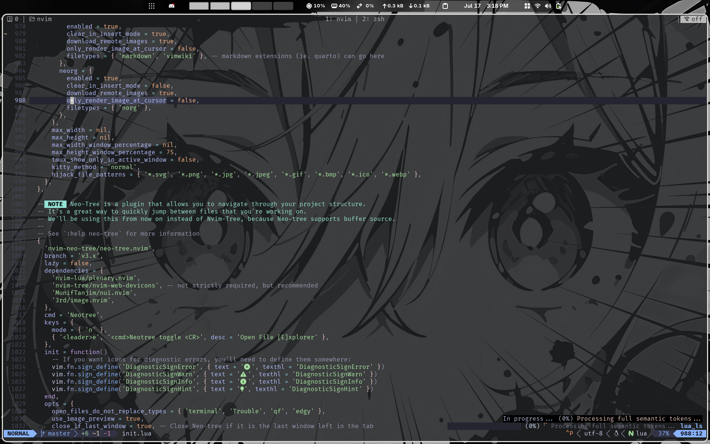

# unemployee.nvim
A Neovim configuration for developers, designed to enhance productivity with a focus on code completion, syntax highlighting, and error checking. This configuration is tailored for various programming languages and integrates seamlessly with GitHub Copilot.

## Languages Supported


## Features
- **Syntax Highlighting**: Provides syntax highlighting for various programming languages.
- **Code Completion**: Offers code completion suggestions to speed up coding.
- **Error Checking**: Detects and highlights errors in the code.
- **Code Formatting**: Automatically formats code according to language-specific standards.
- **Copilot Integration**: Integrates with GitHub Copilot for AI-powered code suggestions.

## Installation

Linux and macOS:
```bash
git clone https://github.com/Ariffansyah/unemployee.nvim.git ~/.config/nvim
```

Windows:
```bash
git clone https://github.com/Ariffansyah/unemployee.nvim.git $HOME/AppData/Local/nvim
```




